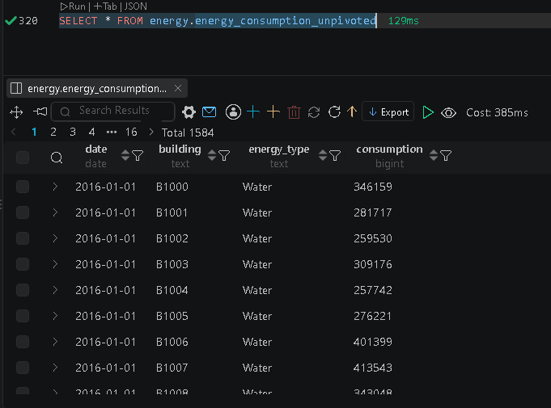
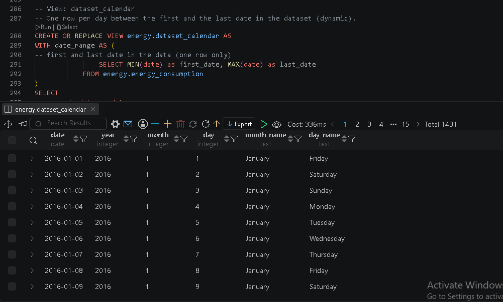

# Energy-Cconsumption-SQL-Analysis
PostgreSQL analysis of building energy consumption and cost (CTEs, window functions, views)---
Analysis of energy consumption (water, electricity, gas) and cost for 11 buildings
in 5 cities, from 2016 to 2019, using PostgreSQL.

## Tools
PostgreSQL, SQL (CTEs, subqueries, window functions, views), Python (pandas, SQLAlchemy)

## What I did
1. Loaded 3 Excel sheets into a PostgreSQL schema called `energy` using Python.
2. Data modeling: SQL-friendly names, data types, primary and foreign keys.
3. Unpivoted the 3 consumption columns using CTEs and UNION ALL (original table not changed).
4. Answered 9 business questions plus 3 of my own.
5. Created 2 dynamic views: `monthly_energy_summary` and `dataset_calendar`.

## Key findings
- Water is about 64% of the total cost, even if its unit price is low, because its volume is very high.
- Building B1008 has the highest total cost (1.50M), and New York has the highest city total.
- Phoenix has the highest average cost per building, because it has only one building.
- Total cost grows every year (+18.9%, +12.8%, +10.9%), but the growth is slowing.

## Screenshots

## Files
- `sql/energy_analysis.sql`: all queries with comments
- `python/load_data.py`: loads the data into PostgreSQL (set `DATABASE_URL` first)

## Dataset
Energy_Consumptions_Dataset.xlsx (course dataset, 3 sheets)
